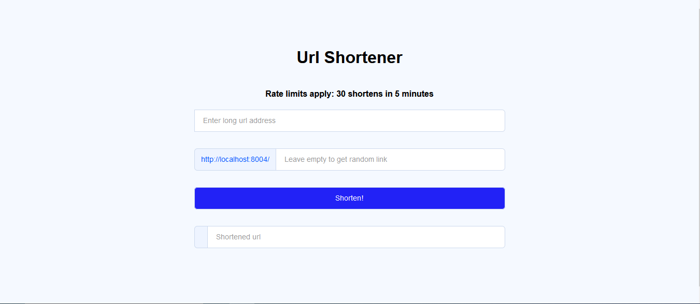

# URL Shortener
#### Simple and modern looking url shortener using firebase rtdb as data storage.



### Configuration

put firebase-secrets.json (firebase service account) in project root directory. 
Run the shortener and let it generate config.json. Change databaseURL to your rtdb url.

### Example config.json
```
{
  "databaseURL": "https://example.firebaseio.com",
  "rateLimiter": {
    "window": 300,
    "amount": 30
  },
  "port": 8008,
  "localization": {
    "loc-name": "URL Shortener",
    "loc-rate-limits": "Rate limits apply: %1 shortens in %2 minutes",
    "loc-long-url-box-p": "Enter long url address",
    "loc-long-surl-box-p": "Leave empty to get random link",
    "loc-shorten-button": "Shorten!",
    "loc-long-surl-out-box-p": "There will be a shortened url",
    "loc-404-error": "404 Not Found",
    "loc-404-h2": "Nobody have ever shortened this",
    "loc-404-shorten-first": "Be first to shorten!"
  }
}
```